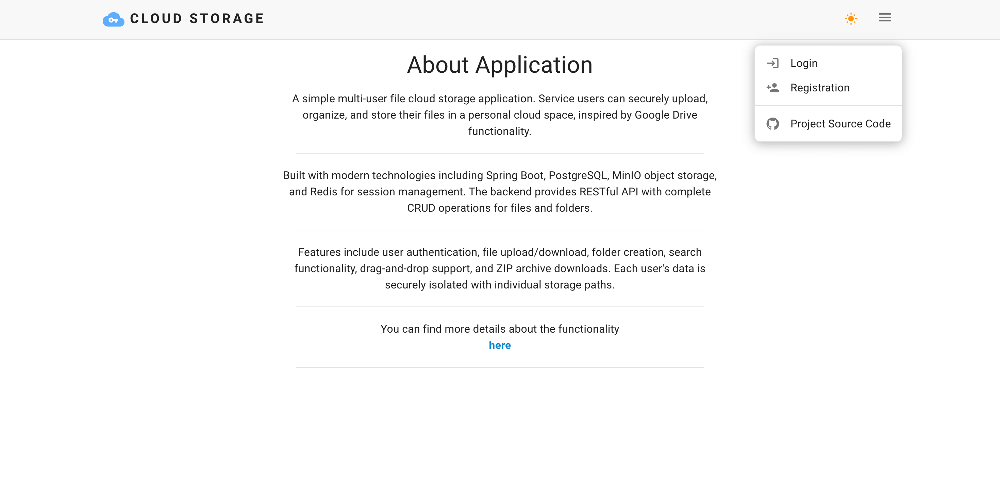
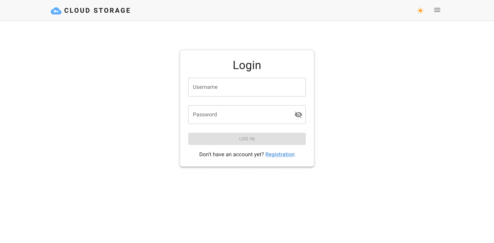
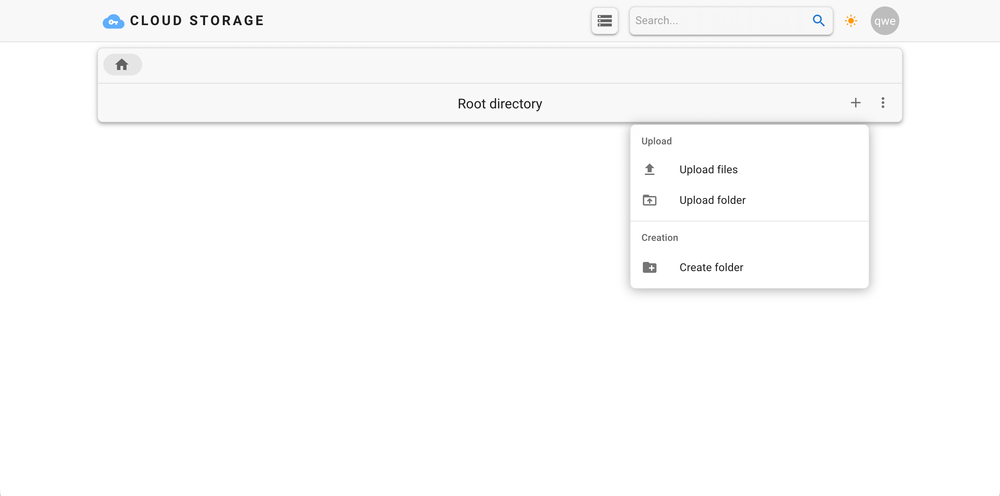
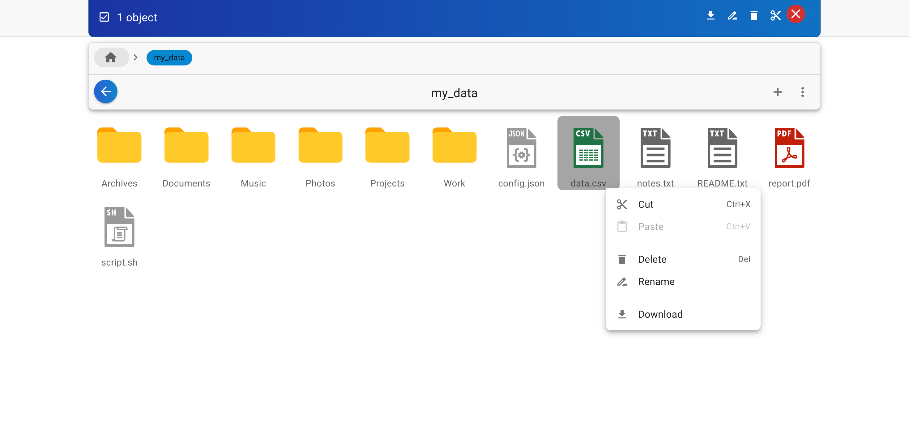
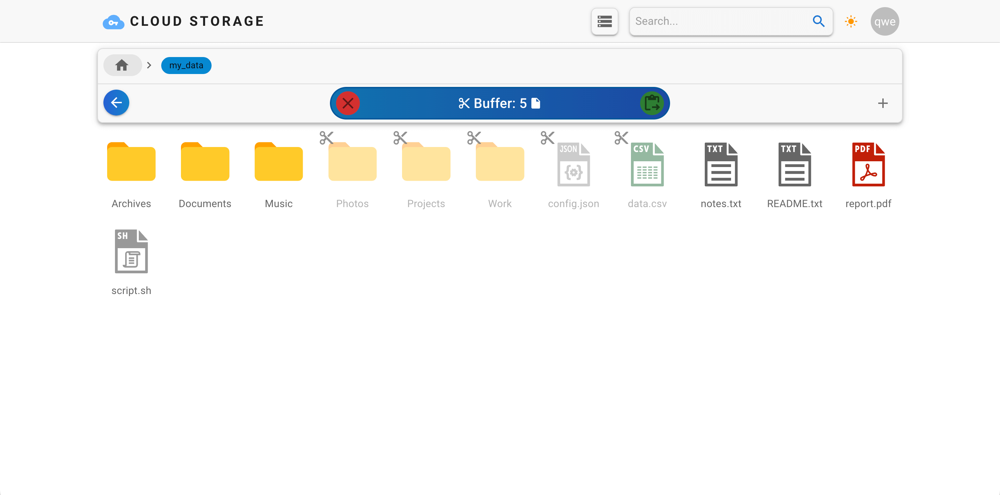
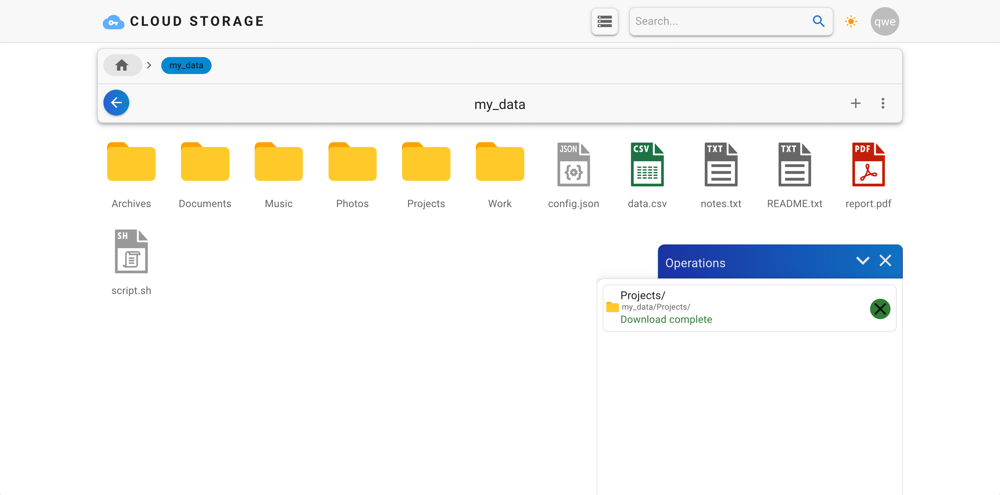
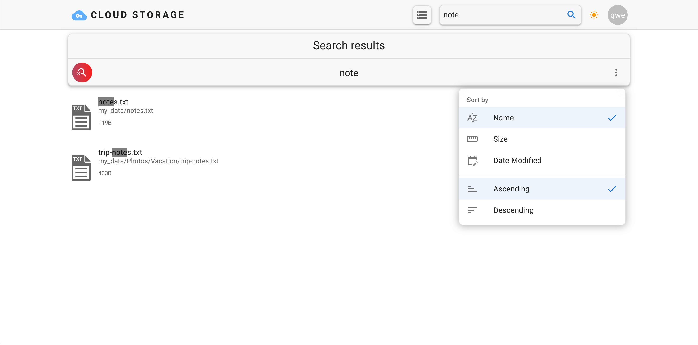
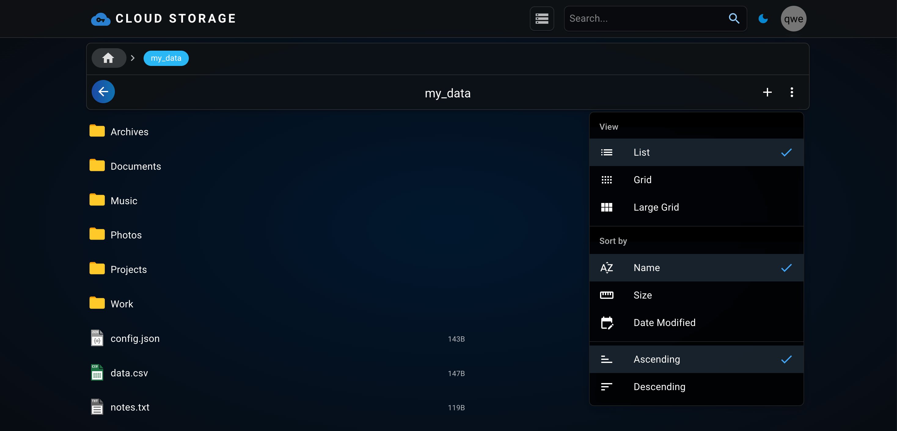

# ☁️ Cloud Storage

> Multi-user cloud file storage with folder support, search, and download functionality. Inspired by Google Drive.

[](https://openjdk.org/)
[](https://spring.io/projects/spring-boot)
[](https://www.postgresql.org/)
[](https://min.io/)
[](https://redis.io/)
[](https://www.docker.com/)

---

## 📋 Table of Contents

- [Features](#-features)
- [Architecture](#-architecture)
- [Tech Stack](#-tech-stack)
- [Quick Start](#-quick-start)
- [API Documentation](#-api-documentation)
- [Screenshots](#-screenshots)
- [Project Structure](#-project-structure)
- [Testing](#-testing)

---

## ✨ Features

### 🔐 User Management
- **Registration** with username and password validation
- **Authentication** via session-based authentication
- **Data Isolation** — each user sees only their own files

### 📁 File and Folder Operations
- ⬆️ **Upload** files and folders (including nested structures)
- 📂 **Create** empty folders
- ⬇️ **Download** files and folders (folders are automatically archived to ZIP)
- ✏️ **Rename** and move resources
- 🗑️ **Delete** files and folders
- 🔍 **Search** by file and folder names (recursive search across all user resources)

### 🎨 Additional Features
- 🌓 **Dark theme** in UI
- 📊 **Swagger UI** for API testing
- 🔒 **Security** — Spring Security with CSRF protection
- 💾 **Persistence** — sessions stored in Redis
- 🚀 **Performance** — support for uploading up to 100 files simultaneously

---

## 🏗️ Architecture

The project is built with a **microservice architecture** using separation of concerns:

```
┌────────────────────────────────────────────────────────────┐
│                   React Frontend (Nginx)                   │
│                    http://localhost:80                     │
└────────────────────────┬───────────────────────────────────┘
                         │ HTTP/REST
┌────────────────────────▼───────────────────────────────────┐
│              Spring Boot Application (JAR)                 │
│                   http://localhost:8080                    │
│  ┌──────────────────────────────────────────────────────┐  │
│  │  Controllers (REST API)                              │  │
│  │  • AuthController    • ResourceController            │  │
│  │  • UserController    • FrontendController            │  │
│  └─────────────┬────────────────────────────────────────┘  │
│                │                                           │
│  ┌─────────────▼────────────────────────────────────────┐  │
│  │  Services (Business Logic)                           │  │
│  │  • StorageService      • DirectoryService            │  │
│  │  • FileOperationsService • SearchService             │  │
│  │  • ResourceMoveService   • ArchiveService            │  │
│  │  • PathService           • ResourceInfoBuilder       │  │
│  │  • UserService                                       │  │
│  └─────┬──────────────────────────┬─────────────────────┘  │
└────────┼──────────────────────────┼────────────────────────┘
         │                          │
    ┌────▼─────┐           ┌────────▼────────┐
    │PostgreSQL│           │      MinIO      │
    │  :5432   │           │ (S3 Storage)    │
    │  Users   │           │     :9000       │
    └────┬─────┘           │  Files/Folders  │
         │                 └─────────────────┘
         │
    ┌────▼─────┐
    │  Redis   │
    │  :6379   │
    │ Sessions │
    └──────────┘
```

### Services and Responsibilities

| Service | Description |
|---------|-------------|
| **PathService** | Path validation and normalization, user isolation |
| **FileOperationsService** | Upload, download, get file information |
| **DirectoryService** | Create, list, delete folders |
| **SearchService** | Search files and folders by query |
| **ArchiveService** | Create ZIP archives for folder downloads |
| **ResourceMoveService** | Move and rename resources |
| **ResourceInfoBuilder** | Build DTOs for resources |
| **UserService** | Registration, authentication, user management |

---

## 🛠️ Tech Stack

### Backend
- **Java 21** — modern LTS version
- **Spring Boot 4.0.1** — core framework
- **Spring Security** — authentication and authorization
- **Spring Data JPA** — database operations
- **Spring Session Data Redis** — session storage
- **Flyway** — database migrations
- **PostgreSQL 17.5** — relational database for users
- **MinIO** — S3-compatible object storage for files
- **Redis 8.4** — session storage
- **Lombok** — reduce boilerplate code
- **Springdoc OpenAPI 3.0** — API documentation auto-generation

### Frontend
- **React** — modern UI framework
- **Nginx** — static file serving

### Testing
- **JUnit 5** — unit and integration tests
- **Testcontainers** — testing with real databases (PostgreSQL, MinIO)
- **Spring Boot Test** — Spring context testing
- **MockMvc** — REST API testing

### DevOps
- **Docker & Docker Compose** — containerization
- **Maven** — project build

---

## 🚀 Quick Start

### Prerequisites

- **Java 21+** ([download](https://adoptium.net/))
- **Docker Desktop** ([download](https://www.docker.com/products/docker-desktop))
- **Maven** (optional, Maven Wrapper included)

### Step 1: Clone the Repository

```bash
git clone https://github.com/your-username/cloud-storage.git
cd cloud-storage
```

### Step 2: Environment Setup

Ensure `.env.example` contains correct settings (configured by default):

```properties
# PostgreSQL
POSTGRES_HOST=localhost
POSTGRES_PORT=5432
POSTGRES_DB=storage
POSTGRES_USER=postgres
POSTGRES_PASSWORD=password

# MinIO (S3-compatible storage)
MINIO_URL=http://localhost:9000
MINIO_BUCKET_NAME=user-files
MINIO_ACCESS_KEY=minioadmin
MINIO_SECRET_KEY=minioadmin
```

### Step 3: Start Infrastructure (Docker Compose)

Start PostgreSQL, Redis, MinIO, and Frontend in Docker:

```bash
docker-compose up -d
```

Verify containers are running:

```bash
docker ps
```

You should see 4 containers: `postgres`, `redis`, `minio`, `frontend-react`.

### Step 4: Build JAR Artifact

```bash
./mvnw clean package -DskipTests
```

After successful build, the JAR file will be at `target/cloud-storage-0.0.1-SNAPSHOT.jar`.

### Step 5: Run Application

```bash
java -jar target/cloud-storage-0.0.1-SNAPSHOT.jar
```

Or use the pre-built JAR from `deploy/` folder:

```bash
java -jar deploy/cloud-storage-0.0.1-SNAPSHOT.jar
```

### Step 6: Access the Application

After successful startup, the application will be available at:

| Service | URL | Description |
|---------|-----|-------------|
| 🌐 **Frontend** | [http://localhost](http://localhost) | React application |
| 🔧 **Backend API** | [http://localhost:8080](http://localhost:8080) | Spring Boot REST API |
| 📚 **Swagger UI** | [http://localhost:8080/swagger-ui/index.html](http://localhost:8080/swagger-ui/index.html) | API documentation |
| 🗄️ **MinIO Console** | [http://localhost:9001](http://localhost:9001) | MinIO console |

---

## 📖 API Documentation

### Swagger UI

Interactive API documentation available at: **[http://localhost:8080/swagger-ui/index.html](http://localhost:8080/swagger-ui/index.html)**

### Main Endpoints

#### 🔐 Authentication

| Method | Endpoint | Description |
|--------|----------|-------------|
| `POST` | `/api/auth/sign-up` | Register new user |
| `POST` | `/api/auth/sign-in` | Sign in |
| `POST` | `/api/auth/sign-out` | Sign out |
| `GET` | `/api/user/me` | Get current user information |

#### 📁 Files and Folders

| Method | Endpoint | Description |
|--------|----------|-------------|
| `GET` | `/api/resource?path={path}` | Get resource information |
| `DELETE` | `/api/resource?path={path}` | Delete resource |
| `GET` | `/api/resource/download?path={path}` | Download file or folder (ZIP) |
| `GET` | `/api/resource/move?from={from}&to={to}` | Move/rename resource |
| `POST` | `/api/resource?path={path}` | Upload files (multipart/form-data) |
| `GET` | `/api/directory?path={path}` | Get folder contents |
| `POST` | `/api/directory?path={path}` | Create new folder |
| `GET` | `/api/resource/search?query={query}` | Search files and folders by name (case-insensitive) |

### API Usage Examples

#### Register User

```bash
curl -X POST http://localhost:8080/api/auth/sign-up \
  -H "Content-Type: application/json" \
  -d '{"username":"testuser","password":"Test123456"}'
```

#### Upload File

```bash
curl -X POST "http://localhost:8080/api/resource?path=my_data/" \
  -H "Cookie: JSESSIONID=your-session-id" \
  -F "object=@text.txt"
```

#### Search Files and Folders

```bash
curl -X GET "http://localhost:8080/api/resource/search?query=document" \
  -H "Cookie: JSESSIONID=your-session-id"
```

**Note:** Search works for both files and folders, including nested folders. For example:
- Query `doc` will find `Documents/` folder and all files containing "doc"
- Query `report` will find `Reports/` folder and `report.pdf` file

---

## 📸 Screenshots

### Home Page

*Main page interface with navigation*

### Login

*Authentication page*

### Empty Storage

*View when no files are present*

### File and Folder List

*Display of user's files and folders*

### File Operations

*Context menu for file operations: rename, move, delete*

### Cut and Move

*Move files and folders between directories*

### Download Folder

*Download folder as ZIP archive*

### Search

*Quick search by file and folder names with sorting capabilities*

### Dark Theme

*Dark theme interface support*

---

## 📂 Project Structure

```
cloud-storage/
├── src/
│   ├── main/
│   │   ├── java/com/example/cloudstorage/
│   │   │   ├── config/                    # Spring configuration
│   │   │   │   ├── MinioConfig.java
│   │   │   │   ├── SecurityConfig.java
│   │   │   │   ├── SessionConfig.java
│   │   │   │   └── ...
│   │   │   ├── controller/                # REST controllers
│   │   │   │   ├── AuthController.java
│   │   │   │   ├── ResourceController.java
│   │   │   │   └── UserController.java
│   │   │   ├── dto/                       # Data Transfer Objects
│   │   │   │   ├── AuthRequest.java
│   │   │   │   ├── ResourceInfo.java
│   │   │   │   └── UserResponse.java
│   │   │   ├── entity/                    # JPA entities
│   │   │   │   └── User.java
│   │   │   ├── exception/                 # Custom exceptions
│   │   │   │   ├── GlobalExceptionHandler.java
│   │   │   │   └── ...
│   │   │   ├── repository/                # Spring Data JPA
│   │   │   │   └── UserRepository.java
│   │   │   ├── security/                  # Security components
│   │   │   │   └── CustomUserDetails.java
│   │   │   └── service/                   # Business logic
│   │   │       ├── StorageService.java
│   │   │       ├── DirectoryService.java
│   │   │       ├── FileOperationsService.java
│   │   │       ├── SearchService.java
│   │   │       ├── ArchiveService.java
│   │   │       ├── ResourceMoveService.java
│   │   │       ├── PathService.java
│   │   │       ├── ResourceInfoBuilder.java
│   │   │       └── UserService.java
│   │   └── resources/
│   │       ├── application.yml            # Application configuration
│   │       ├── db/migration/              # Flyway migrations
│   │       │   └── V1__Create_Table_Users.sql
│   │       └── static/                    # React frontend (built)
│   └── test/                              # Tests
│       └── java/com/example/cloudstorage/
│           └── service/
│               ├── StorageServiceTest.java
│               └── UserAuthTest.java
├── docker/                                # Docker configuration
│   └── frontend/
│       ├── Dockerfile
│       └── nginx.conf
├── screenshots/                           # Application screenshots
├── deploy/                                # Production-ready JAR
│   └── cloud-storage-0.0.1-SNAPSHOT.jar
├── docker-compose.yml                     # Docker Compose configuration
├── .env.example                           # Environment variables example
├── pom.xml                                # Maven configuration
└── README.md                              # This file
```

### Key Modules

#### 1. **Controllers** (REST API Layer)
- Handle HTTP requests
- Input validation
- Swagger annotations for documentation

#### 2. **Services** (Business Logic)
- Separated by Single Responsibility Principle (SRP)
- Each service handles its own domain
- Explicit exception handling

#### 3. **Security**
- Session-based authentication
- Password hashing (BCrypt)
- CSRF protection
- Cookie settings (HttpOnly, SameSite)

#### 4. **Storage**
- User file isolation: `user-{id}-files/`
- Folder hierarchy support
- Automatic ZIP creation for folders

---

## 🧪 Testing

### Run All Tests

```bash
./mvnw test
```

### Test Coverage

The project contains **33 integration and unit tests**:

- ✅ **Authentication** — registration, sign in, sign out
- ✅ **File Operations** — upload, download, delete
- ✅ **Folder Operations** — create, list, delete
- ✅ **Search** — search files and folders by name (recursive, case-insensitive)
- ✅ **Move** — rename and move resources
- ✅ **User Isolation** — access only own files

### Testing Technologies

- **Testcontainers** — real PostgreSQL and MinIO in Docker containers
- **MockMvc** — REST API testing
- **JUnit 5** — testing framework
- **AssertJ** — readable assertions

### Run Specific Test

```bash
./mvnw test -Dtest=StorageServiceTest
```

---

## 🔧 Configuration

### Environment Variables

All settings can be changed via `.env.example`:

```properties
# Database
POSTGRES_HOST=localhost
POSTGRES_PORT=5432
POSTGRES_DB=storage
POSTGRES_USER=postgres
POSTGRES_PASSWORD=password

# MinIO
MINIO_URL=http://localhost:9000
MINIO_BUCKET_NAME=user-files
MINIO_ACCESS_KEY=minioadmin
MINIO_SECRET_KEY=minioadmin
```

### Spring Profiles

- **dev** (default) — with SQL logging and DEBUG mode
- **prod** — minimal logs, optimized for production

Switch profile:

```bash
java -jar target/cloud-storage-0.0.1-SNAPSHOT.jar --spring.profiles.active=prod
```

### File Upload Settings

In `application.yml` you can change limits:

```yaml
spring:
  servlet:
    multipart:
      max-file-size: 50MB      # Maximum file size
      max-request-size: 50MB   # Maximum request size

server:
  tomcat:
    max-part-count: 100        # Maximum files per request
```

---

## 🐳 Docker Compose

### Start Infrastructure

```bash
docker-compose up -d
```

### Stop

```bash
docker-compose down
```

### Full Cleanup (with data removal)

```bash
docker-compose down -v
```

### View Logs

```bash
docker-compose logs -f
```

---

## 📝 Implementation Highlights

### 1. Microservice Architecture at Service Level

Instead of monolithic `StorageService` (489 lines), the project is split into **6 specialized services**:
- Improved maintainability
- Simplified testing
- Follows SRP (Single Responsibility Principle)

### 2. User Isolation

Each user has their own root folder in MinIO: `user-{id}-files/`
- Users cannot see other users' files
- File path in API doesn't contain `user-{id}-files/` reference (hidden in services)

### 3. Exception Handling

- Centralized `GlobalExceptionHandler`
- Clear error messages
- All exceptions logged

### 4. No @SneakyThrows

All exceptions handled explicitly via `try-catch` or `throws Exception`:
- Improved readability
- Explicit method contracts
- Easier debugging

### 5. ZIP Archive Support

When downloading a folder, a ZIP archive is automatically created:
- Recursive packing of all files and subfolders
- Streaming for large folders (not loaded into memory)

### 6. Flyway Migrations

Database schema versioning:
- Automatic migration application on startup
- Database change history

---

## 📄 License

This project was created for educational purposes and is provided "as is".

---

## 🔗 Useful Links

- [Spring Boot Documentation](https://docs.spring.io/spring-boot/documentation.html)
- [MinIO Java SDK](https://docs.min.io/enterprise/aistor-object-store/developers/sdk/#java)
- [Spring Security Reference](https://docs.spring.io/spring-security/reference/index.html)
- [Testcontainers](https://testcontainers.com/)

---

<div align="center">

Made with ☕ and 💻

</div>
